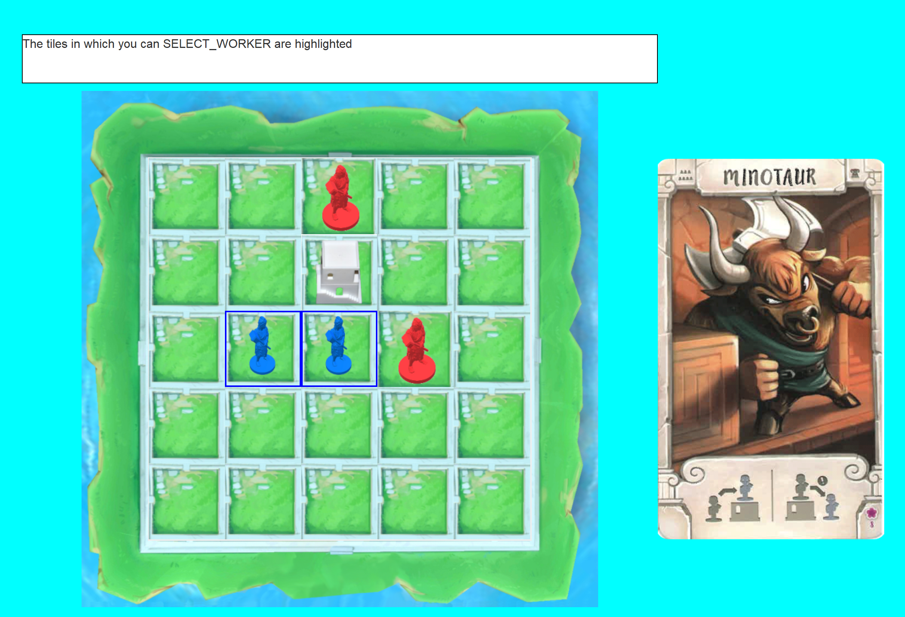

# Software Engineering 2020

## Getting Started

The Politecnico di Milano committed the project as the final test of the course 
Software Engineering year 2019/2020.<br>The project specifications require the development 
of a software version of the already existing game table lamp by Cranio Creations.<br>
The pdf with the rules of the game is available [HERE](https://github.com/nickpolvani/Santorini/blob/master/santorini_rules_en.pdf)



### Prerequisites

Install Java and maven on your PC. You can download maven from this [link](https://maven.apache.org/download.cgi)

### Installing

Open a terminal in the project folder, then run:

```
mvn clean
mvn package
```
If it is the first time you build the project you can run only:

```
mvn package
```
### Run the project

To launch the server run: 
```
java -jar target\ing-sw-2020-GC11-1.0-SNAPSHOT-jar-with-dependencies.jar server
```
To launch the client gui:
 ```
 java -jar target\ing-sw-2020-GC11-1.0-SNAPSHOT-jar-with-dependencies.jar gui
 ```
To launch the client cli:
 ```
 java -jar target\ing-sw-2020-GC11-1.0-SNAPSHOT-jar-with-dependencies.jar cli
 ```

### Running the tests
 ```
 mvn test
 ```

## Built With

* [JUnit4](https://junit.org/junit4/) - The test framework used
* [Maven](https://maven.apache.org/) - Dependency Management
* [jansi](https://github.com/fusesource/jansi) - Used for command-line style
